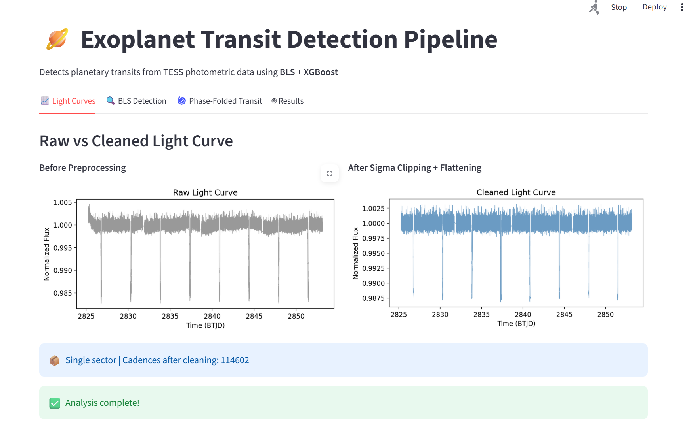
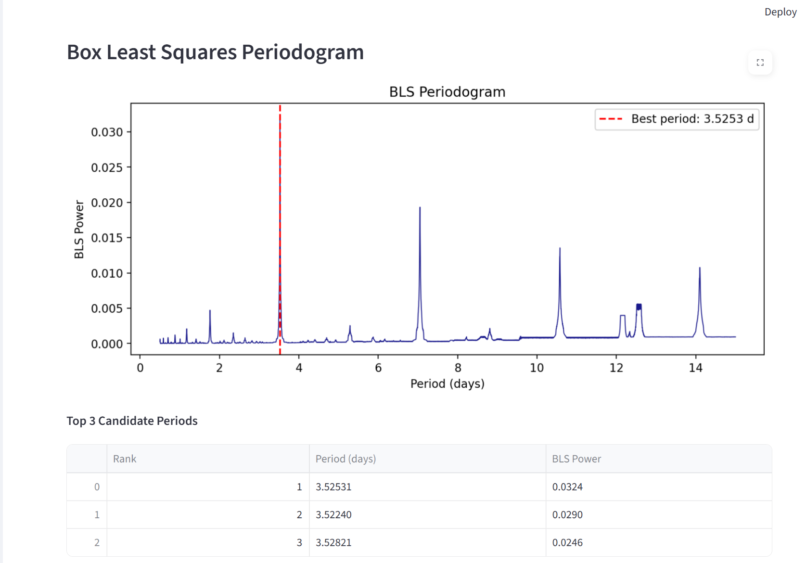
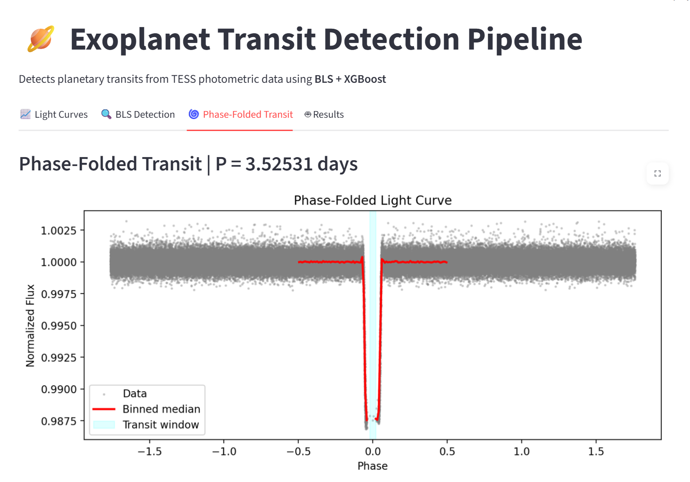
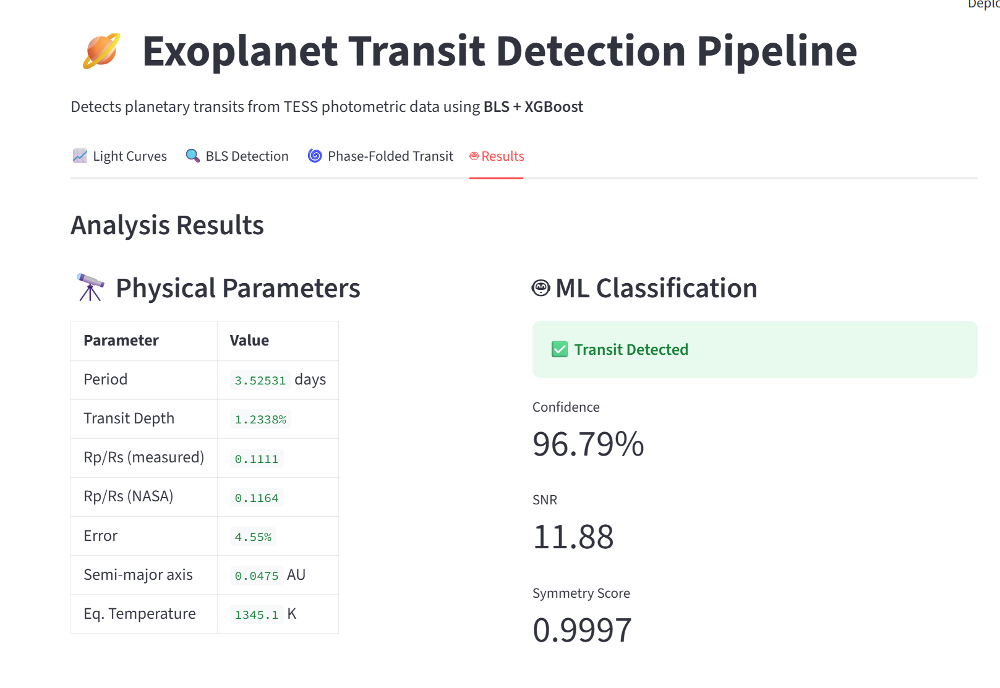

# Exoplanet Transit Detection using NASA TESS Data

Machine Learning pipeline for detecting potential exoplanets from NASA TESS photometric light curve data. The system combines astronomical transit detection using the Box Least Squares (BLS) algorithm with XGBoost-based classification to identify likely exoplanet candidates.

## Features

- Automated transit signal detection from stellar light curves
- Feature extraction using BLS periodogram analysis
- XGBoost-based candidate classification
- Interactive Streamlit dashboard for visualization
- End-to-end preprocessing, training, and evaluation pipeline

## Dataset

- **Source:** NASA TESS (Transiting Exoplanet Survey Satellite)
- **Archive:** https://archive.stsci.edu/missions-and-data/tess
- Photometric light curve observations from multiple target stars
- ~100–200 MB of processed observational data

## Tech Stack

### Machine Learning
- XGBoost
- Scikit-learn

### Data Processing
- NumPy
- Pandas

### Astronomy & Signal Processing
- Astropy
- Lightkurve

### Visualization
- Matplotlib
- Streamlit

## Workflow

```text
TESS Light Curve Data
        ↓
Data Preprocessing
        ↓
BLS Transit Detection
        ↓
Feature Engineering
        ↓
XGBoost Classification
        ↓
Model Evaluation
        ↓
Streamlit Dashboard
```
## Results

The pipeline successfully identifies periodic transit events from NASA TESS light curve data using BLS periodogram analysis and XGBoost classification.

### Detection for Planet HD 209458

| Metric | Value |
|----------|----------|
| Detected Period | 3.52531 days |
| Transit Depth | 1.2338% |
| Classification Confidence | 96.79% |
| Signal-to-Noise Ratio (SNR) | 11.88 |
| Symmetry Score | 0.9997 |
| Estimated Semi-Major Axis | 0.0475 AU |
| Estimated Equilibrium Temperature | 1345.1 K |

### Key Outputs

- Noise reduction using sigma clipping and light curve flattening
- Transit candidate identification through BLS periodograms
- Phase-folded transit visualization
- Automated feature extraction
- XGBoost-based transit classification
- Physical parameter estimation for detected candidates

## Dashboard Preview

### Light Curve Preprocessing


### BLS Periodogram Analysis


### Phase Folded Transit


### Final Prediction Dashboard

## Installation

```bash
git clone https://github.com/mahi-mahalle/Exoplanet_Detection.git
cd Exoplanet_Detection

python -m venv venv
source venv/bin/activate

pip install -r requirements.txt
```

## Run

```bash
streamlit run app.py
```

## Applications

- Exoplanet candidate screening
- Astronomical time-series analysis
- Scientific machine learning
- Transit signal detection
